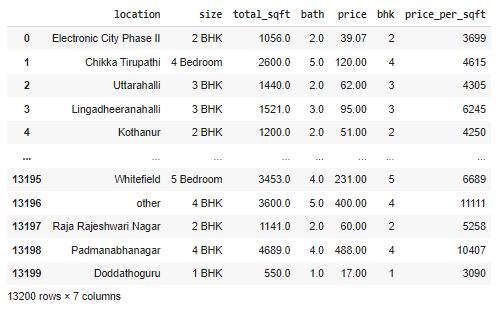

# Ex02-Outlier

You are given bhp.csv which contains property prices in the city of banglore, India. You need to examine price_per_sqft column and do following,

(1) Remove outliers using IQR 

(2) After removing outliers in step 1, you get a new dataframe.

(3) use zscore of 3 to remove outliers. This is quite similar to IQR and you will get exact same result

(4) for the data set height_weight.csv find the following

    (i) Using IQR detect weight outliers and print them

    (ii) Using IQR, detect height outliers and print them

# CODE
```

import pandas as pd
import numpy as np
import seaborn as sns
df=pd.read_csv("bhp.csv")
df
df.head
df.info()
df.describe()
df.isnull().sum()
df.shape
sns.boxplot(x="price_per_sqft",data=df)
q1=df['price_per_sqft'].quantile(0.25)
q3=df['price_per_sqft'].quantile(0.75)
print("First Quantile=",q1,"\nSecond Quantile=",q3)
IQR=q3-q1
u1=q3+1.5*IQR
ll=q1-1.5*IQR
df1=df[((df['price_per_sqft']>=ll)&(df['price_per_sqft']<=u1))]
df1
df1.shape
sns.boxplot(x="price_per_sqft",data=df1)
from scipy import stats
z=np.abs(stats.zscore(df['price_per_sqft']))
df2=df[(z<3)]
df2
sns.boxplot(x="price_per_sqft",data=df2)
df3=pd.read_csv("height_weight.csv")
df3
df3.head()
df3.info()
df3.describe()
df3.isnull.sum()
df3.shape
q1 = df3['weight'].quantile(0.25)
q3 = df3['weight'].quantile(0.75)
print("First Quantile =",q1,"\nSecond Quantile =",q3)
IQR = q3-q1
ul = q3+1.5*IQR
ll = q1-1.5*IQR
df4 =df3[((df3['weight']>=ll)&(df3['weight']<=ul))]
df4
df4.shape

sns.boxplot(x="weight",data=df4)
sns.boxplot(x="height",data=df3)

q1 = df3['height'].quantile(0.25)
q3 = df3['height'].quantile(0.75)
print("First Quantile =",q1,"\nSecond Quantile =",q3)

IQR = q3-q1
ul = q3+1.5*IQR
ll = q1-1.5*IQR
df5 =df3[((df3['height']>=ll)&(df3['height']<=ul))]
df5
df5.shape
sns.boxplot(x="height",data=df5)

```

# OUTPUT



### HEAD


### INFO


### DESCRIBE


### ISNULL()SUM()


### SHAPE


### BOXPLOT


### QUANTILE


### IQR


### SHAPE


### BOXPLOT


###  ZSCORE


### BOXPLOT


### READ


### HEAD


### INFO


### DESCRIBE


### NULL


### SHAPE


### BOXPLOT


### QUANTILE


### IQR


### BOXPLOT WEIGHT


### BOXPLOT HEIGHT


### QUANTILE


### IQR


### SHAPE


### BOXPLOT


# RESULT

Hence the outlier is detected and reduced the error successfully.


